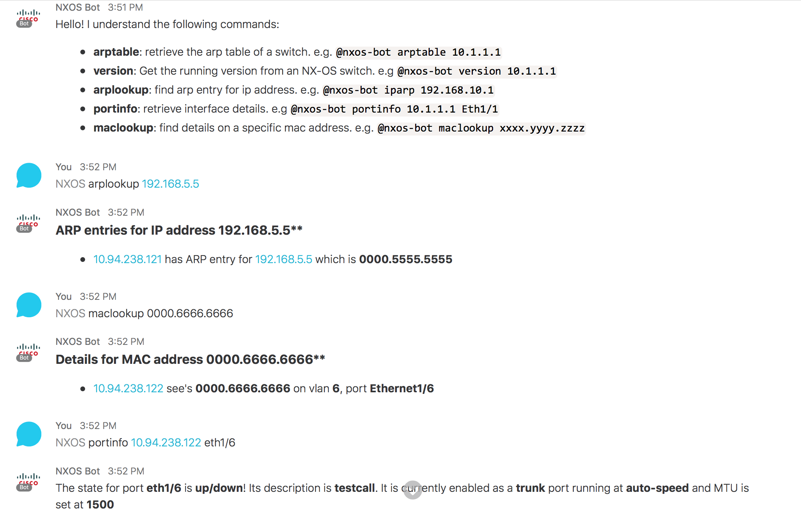

# NX-OS Spark Bot

This is a sample sparkbot which will get useful information from an NX-OS device.

Here is a screenshot with the current capabilities:




# Using this bot

If you don't already have a Cisco Spark account, go ahead and register for one.  They are free.

You'll need to start by adding your bot to the Cisco Spark website.

https://developer.ciscospark.com/add-app.html


1. Click create bot


2. Fill out all the details about your bot, including a publicly hosted avatar image


3. Click "Add Bot", make sure to copy your access token, you will need this in a second


# Installation

Create a virtualenv and install the module

```
virtualenv venv
source venv/bin/activate
pip install -r requirements.txt
```

# Configuration

The easiest way to use this module is to set a few environment variables

```
export SPARK_BOT_URL=https://mypublicsite.io
export SPARK_BOT_TOKEN=<your bots token>
export SPARK_BOT_EMAIL=<your bots email?
export SPARK_BOT_APP_NAME=<your bots name>
export NXOS_PASSWORD=cisco
export NXOS_LOGIN=admin
```

You'll also want to modify the [config.py](./config.py) file and update the list
of switches for your environment.

```
switches = ['dist-sw-01','dist-sw-02','10.10.10.10']
```

# ngrok

ngrok will make easy for you to develop with a live bot.

You can find installation instructions here: https://ngrok.com/download

After you've installed ngrok, in another window start the service


`ngrok http 5000`


You should see a screen that looks like this:

```
ngrok by @inconshreveable                                                                                                                                 (Ctrl+C to quit)

Session Status                online
Version                       2.2.4
Region                        United States (us)
Web Interface                 http://127.0.0.1:4040
Forwarding                    http://this.is.the.url.you.need -> localhost:5000
Forwarding                    https://this.is.the.url.you.need -> localhost:5000

Connections                   ttl     opn     rt1     rt5     p50     p90
                              2       0       0.00    0.00    0.77    1.16

HTTP Requests
-------------

POST /                         200 OK
```

Make sure and update your environment with this url:

```
export SPARK_BOT_URL=https://this.is.the.url.you.need

```

Now launch your bot!!


```
python bot.py
```
